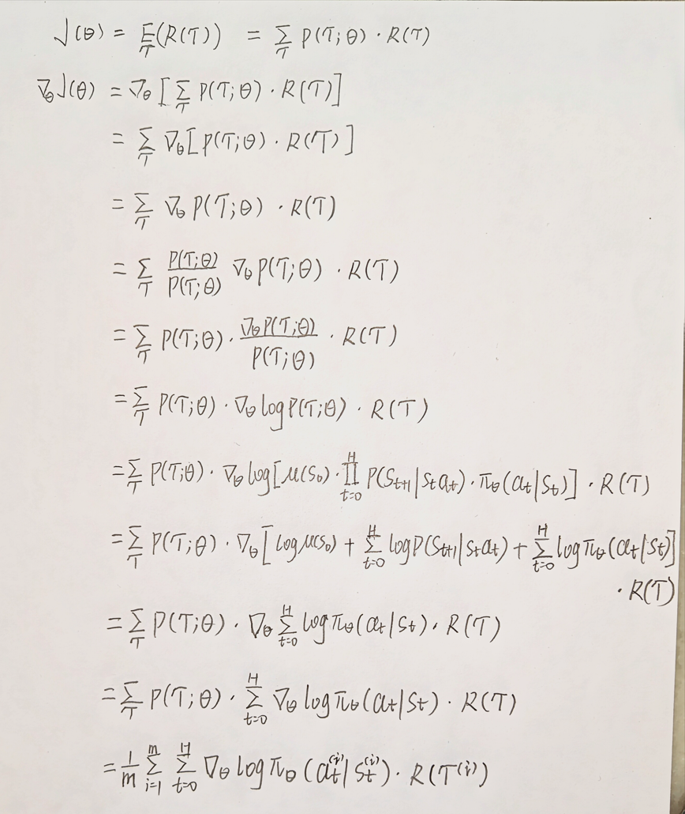
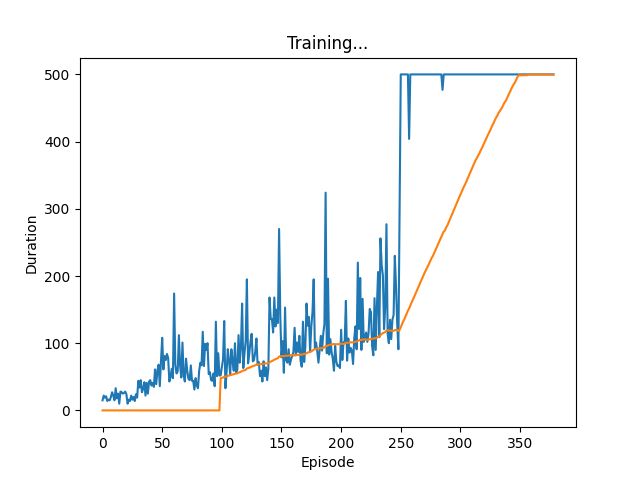

A minimal implementation of Policy Gradient in reinforcement learning. 

中文视频教程：【大白话强化学习之 Policy Gradient（导言）】 https://www.bilibili.com/video/BV1k99VYQECf/?share_source=copy_web&vd_source=2aba9850707692352c51dabec96cb172

Our target is to keep the code easy enough to read and understand the theory behind gradient policy mathematical derivation:

# Training

call `train()` to start training. Press `S` to save a checkpoint, press `Q` to abort the training.

We are using CartPole-v0 as an example to train. The training should converge to max steps (500 steps) around **200 to 1000** steps.

# Evaluating

call `eval()` to start evaluate a checkpoint. Press `Q` to abort evaluating.

# Thanks

A great thanks to:

https://huggingface.co/learn/deep-rl-course/unit4/pg-theorem

https://github.com/Finspire13/pytorch-policy-gradient-example